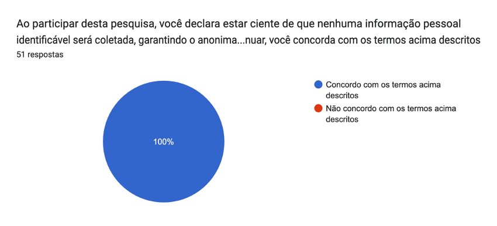
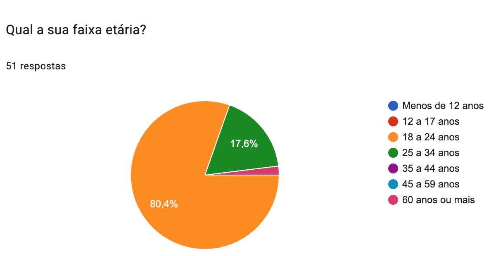
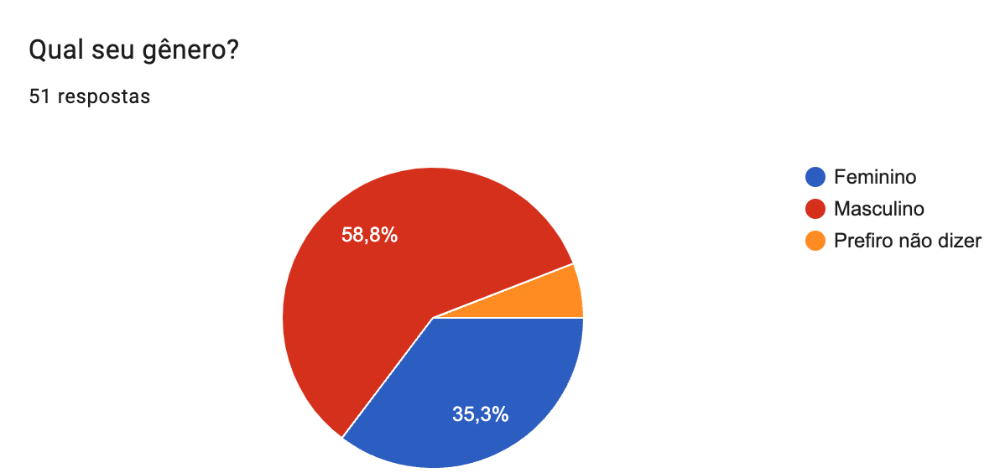
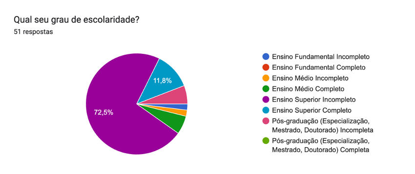
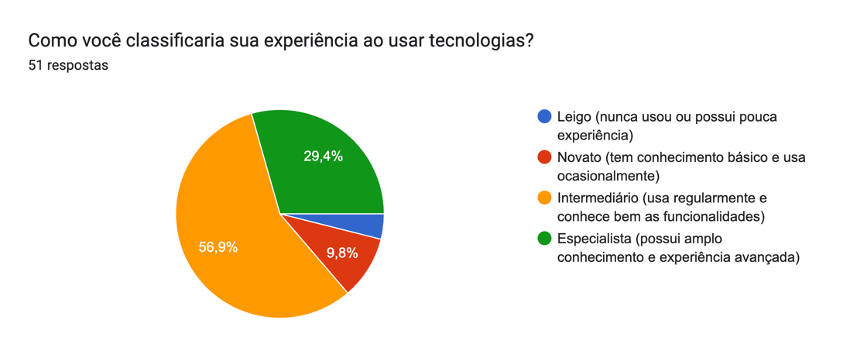
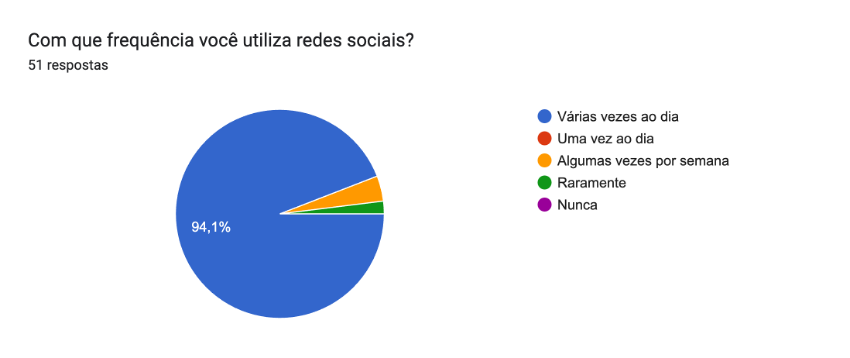
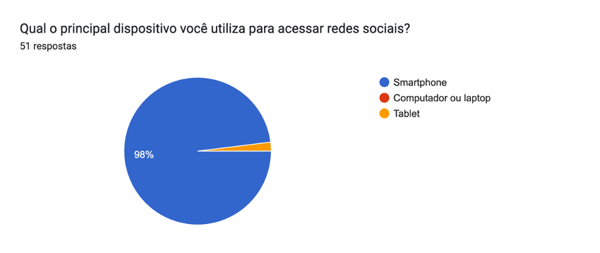
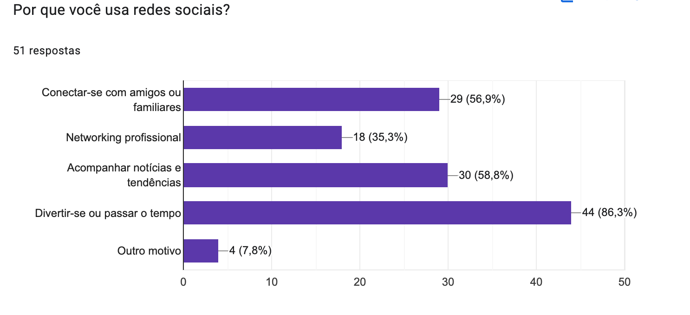

## Introdução

Entender as características, necessidades e comportamentos dos usuários é essencial para criar sistemas eficazes e alinhados às expectativas do público-alvo. Segundo Barbosa e Silva (2010), a definição do perfil de usuário é o primeiro passo para registrar e compreender suas particularidades, traçando um perfil detalhado sobre eles. Esse processo é fundamental para entender o público-alvo e garantir que os produtos desenvolvidos atendam às suas necessidades de forma adequada.

## Metodologia

A elaboração do perfil de usuário foi fundamentada na coleta de dados por meio de um questionário estruturado. O questionário, composto por 7 perguntas, abordou aspectos gerais como idade, gênero, frequência de uso do aplicativo, escolaridade e a motivação para utilizarem as redes sociais. Para alcançar um público relevante, o questionário foi amplamente divulgado em comunidades digitais, utilizando aplicativos como WhatsApp e Telegram. A divulgação priorizou grupos relacionados ao contexto do aplicativo, assegurando a participação de pessoas com maior probabilidade de interagir com a solução em desenvolvimento.

## Resultado do Questionário

O questionário contou com um total de 51 respostas, todas concordando com o termo de consentimento apresentado na Figura 1.

<strong> Figura 1</strong> - Termo de consentimento

 Autor:  [Alana Gabriele](https://github.com/alanagabriele)  

Nas Figuras 2 a 8, são apresentados os resultados de cada pergunta, juntamente com suas respectivas respostas.

### Idade

De acordo com a Figura 2, a maioria dos participantes tem idade entre 18 e 24 anos.

<strong> Figura 2</strong> - Idade

 Autor:  [Alana Gabriele](https://github.com/alanagabriele)  

### Gênero

De acordo com a Figura 3, o gênero predominante é o masculino

<strong> Figura 3</strong> - Gênero

 Autor:  [Alana Gabriele](https://github.com/alanagabriele)  

### Grau de escolaridade

De acordo com a Figura 4, o grau de escolaridade predominante é ensino superior incompleto.

<strong> Figura 4</strong> - Escolaridade

 Autor:  [Alana Gabriele](https://github.com/alanagabriele)  

### Nível de experiência com tecnologia

De acordo com a Figura 5, o nível de experiência com tecnologia predominante é intermediário (usa regularmente e conhece bem as funcionalidades).

<strong> Figura 5</strong> - Experiência com tecnologia

 Autor:  [Alana Gabriele](https://github.com/alanagabriele)  

### Frequência de uso das redes sociais

De acordo com a Figura 6, a maioria dos participantes usa as redes sociais várias vezes ao dia.

<strong> Figura 6</strong> - Experiência com tecnologia

 Autor:  [Alana Gabriele](https://github.com/alanagabriele)  

### Dispositivo utilizado para acessar redes sociais

De acordo com a Figura 7, a maioria dos participantes utiliza o celular para acessar as redes sociais.

<strong> Figura 7</strong> - Dispositivo

 Autor:  [Alana Gabriele](https://github.com/alanagabriele)  

### Motivo para usar redes sociais

As respostas, apresentadas na Figura 8, indicam que os participantes utilizam as redes sociais por diferentes motivos, já que foi permitido selecionar mais de uma opção. Entre essas motivações, o entretenimento aparece como o principal destaque, seguido pela interação social e pela busca por informações e tendências.

<strong> Figura 8</strong> - Motivo

 Autor:  [Alana Gabriele](https://github.com/alanagabriele)  

## Perfil do Usuário

Com base nas informações obtidas podemos montar o perfil do usuário contido na **Tabela 1**.

 Tabela 1 - Perfil do Usuário 

| Característica                                   | Descrição                  |
| ------------------------------------------------ | -------------------------- |
| Idade                                            | Jovens de 18 a 24 anos     |
| Gênero                                           | Masculino                  |
| Grau de escolaridade                             | Ensino superior incompleto |
| Nível de conhecimento tecnológico                | Intermediário              |
| Frequência de uso das redes sociais              | Várias vezes ao dia        |
| Dispositivo utilizado para acessar redes sociais | Celular                    |
| Motivo para usar redes sociais                   | Entretenimento             |

 Autor: [Alana Gabriele](https://github.com/alanagabriele) 

A partir da descoberta do perfil do usuário serão elaboradas as personas e também escolhidos os participantes de futuras avaliações.

## Bibliografia

> BARBOSA, S. D. J.; SILVA, B. S. Interação Humano-Computador. Rio de Janeiro: Elsevier, 2011.  

> Cooper, Alan, et al. About Face 3 : The Essentials of Interaction Design. Indianapolis, Ind., Wiley, 2007. Disponível em: https://aprender3.unb.br/pluginfile.php/2972438/mod_resource/content/1/About_Face_3__The_Essentials_of_Interaction_Design.pdf. Acesso em: 23 de nov. 2024.  

## Histórico de Versões

| Versão | Data       | Descrição            | Autor                                              | Revisor                                          |
| :----: | ---------- | -------------------- | -------------------------------------------------- | ------------------------------------------------ |
|  1.0   | 22/11/2024 | Criação do documento | [Carlos Eduardo](https://github.com/dudupaz)       | [Genilson Silva](https://github.com/GenilsonJrs) |
|  1.1   | 23/11/2024 | Perfil do usuário    | [Alana Gabriele](https://github.com/alanagabriele) | [Carlos Eduardo](https://github.com/dudupaz)     |
