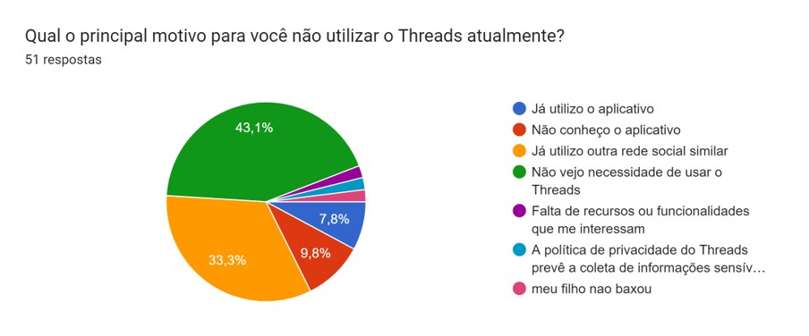
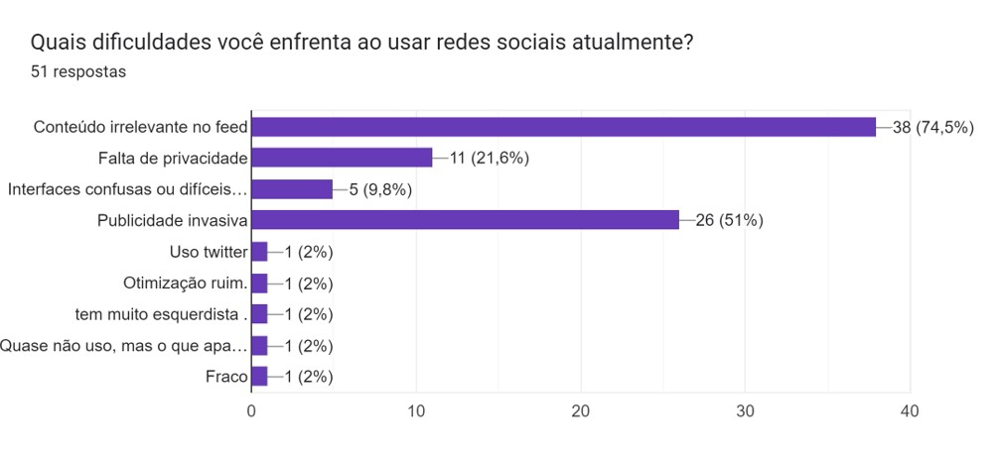
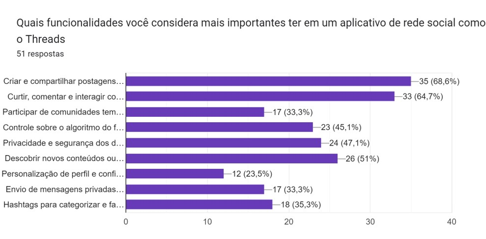
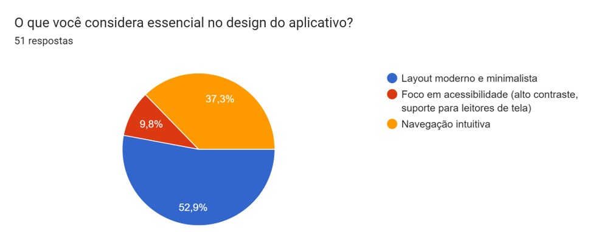
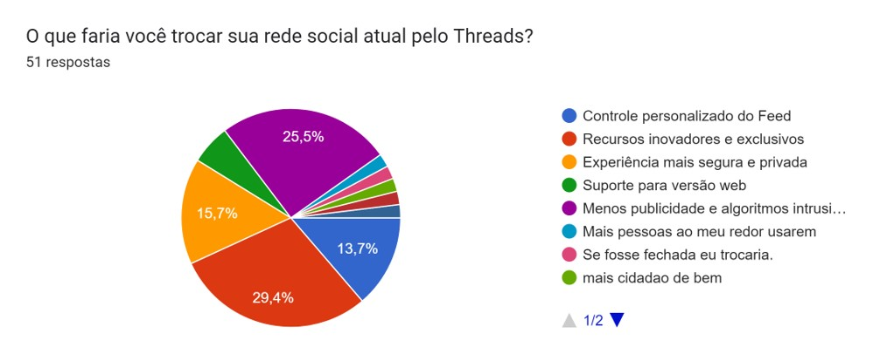
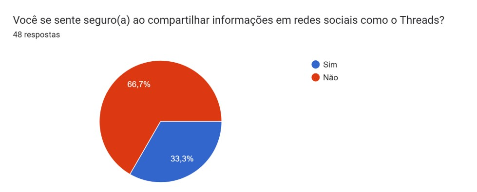
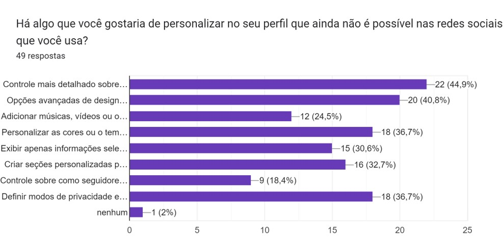

## Introdução

O questionário é uma técnica estruturada para elicitação de requisitos que utiliza um conjunto de perguntas organizadas em formato escrito para obter informações de um grupo de pessoas. Essa técnica é especialmente útil quando há um número significativo de usuários ou stakeholders, pois permite coletar opiniões e dados de forma rápida e eficiente.

De acordo com Sommerville (2015), questionários podem incluir questões abertas, que permitem respostas mais detalhadas e opinativas, ou questões fechadas, que são mais objetivas e fáceis de analisar. Essa flexibilidade torna o questionário uma ferramenta valiosa para identificar necessidades, avaliar percepções e validar ideias durante o processo de desenvolvimento de software.

### Objetivos

- Identificar as necessidades dos usuários.
- Coletar dados quantitativos e qualitativos para análise.
- Validar hipóteses ou funcionalidades propostas.

## Metodologia

A metodologia aplicada seguiu as seguintes etapas:

### Definição dos Objetivos

Antes da elaboração do questionário, foi definido que o principal objetivo seria identificar problemas enfrentados pelos usuários, além de levantar sugestões para possíveis melhorias.

### Elaboração das Perguntas

As perguntas foram elaboradas com base na técnica **5W + 2H**, garantindo uma cobertura completa das informações relevantes. Para otimizar a análise, as questões foram classificadas em:

- **Fechadas**: Respostas rápidas e objetivas (ex.: múltipla escolha, escala de satisfação).

### Seleção do Público-Alvo

Os participantes foram selecionados considerando os seguintes perfis:

- Usuários frequentes do software.
- Stakeholders interessados no projeto.
- Novos usuários em potencial.

### Aplicação do Questionário

O questionário foi disponibilizado em formato digital por meio da ferramenta **Google Forms**. Os participantes tiveram um prazo de 3 dias para responder.

### Resultados coletados

### Questao 1

Figura 1 - Pergunta 1 

 Fonte : [Forms](https://forms.gle/6tbhEHaEmdNR47qR8) 

### Questao 2

Figura 2 - Pergunta 2

 Fonte : [Forms](https://forms.gle/6tbhEHaEmdNR47qR8) 

### Questao 3

Figura 2 - Pergunta 3

 Fonte : [Forms](https://forms.gle/6tbhEHaEmdNR47qR8) 

### Questao 4

Figura 4 - Pergunta 4

 Fonte : [Forms](https://forms.gle/6tbhEHaEmdNR47qR8) 

### Questao 5

Figura 5 - Pergunta 5

 Fonte : [Forms](https://forms.gle/6tbhEHaEmdNR47qR8) 

### Questao 6

Figura 6 - Pergunta 6

 Fonte : [Forms](https://forms.gle/6tbhEHaEmdNR47qR8) 

### Questao 7

Figura 7 - Pergunta 7

 Fonte : [Forms](https://forms.gle/6tbhEHaEmdNR47qR8) 

### Tabela de Resultados do Questionário

**Tabela 1** - Resultados. 

| **Questão**                                  | **Resposta mais comum (%)**                            | **Observações**                                                                                                     |
| -------------------------------------------- | ------------------------------------------------------ | ------------------------------------------------------------------------------------------------------------------- |
| **1. atualmente**                            | 43,1% Não vejo necessidade                             | Maioria vê o aplicativo como não essencial. Ajustar marketing para destacar diferenciais pode atrair mais usuárs.   |
| **2. Dificuldades em redes sociais**         | 74,5% Conteúdo irrelevante no feed                     | Evidência da necessidade de controle personalizado do algoritmo e curadoria do conteúdo exibido.                    |
| **3. Funcionalidades mais importantes**      | 68,6% Criar e compartilhar postagens                   | Postagens são essenciais, seguidas por interação e descoberta de novos conteúdos (64,7% e 51%, respectivamente).    |
| **4. Essencial no design do aplicativo**     | 52,9% Layout moderno e minimalista                     | Usuários valorizam simplicidade e modernidade no design.                                                            |
| **5. Segurança ao compartilhar informações** | 66,7% Não se sente seguro                              | Segurança e privacidade são grandes preocupações.                                                                   |
| **6. Personalização de perfil desejada**     | 44,9% Controle detalhado sobre quem pode ver postagens | Necessidade de controle granular de privacidade, com personalização adicional de layout e cores também bem citados. |
| **7. Motivos para trocar para o Threads**    | 29,4% Recursos inovadores e exclusivos                 | Criar diferenciais e melhorar a segurança são os fatores mais persuasivos para atrair novos usuários.               |

 Autor: [Samuel Ribeiro](https://github.com/SamuelRicosta) 

### Análise dos Dados

Através do questionário, foi possível identificar que grande parte dos usuários ainda não vê necessidade de utilizar o Threads ou já utiliza redes sociais similares . Além disso, muitos relatam dificuldades com conteúdo irrelevante no feed e preocupações com privacidade , evidenciando a necessidade de maior controle sobre o algoritmo e políticas mais transparentes.

Os usuários valorizam funcionalidades como criar postagens , interagir com outros e descobrir novos conteúdos . No design, destacam-se preferências por layouts minimalistas e navegação intuitiva . Contudo, a segurança permanece uma preocupação, com afirmando não se sentirem seguros ao compartilhar informações.

Por fim, personalização de perfis e diferenciais exclusivos foram apontados como fatores essenciais para atrair usuários, reforçando a importância de uma experiência mais segura, inovadora e alinhada às expectativas.

---

### Requisitos Elicitados

**Tabela 2** - Requisos levantados . 

| **Identificador** | **Requisito**                                                                                   | **Tipo** |
| ----------------- | ----------------------------------------------------------------------------------------------- | -------- |
| **01**            | Permitir personalização detalhada do feed e controle de conteúdo exibido.                       | RF       |
| **02**            | Garantir um ambiente seguro com melhorias na política de privacidade.                           | RNF      |
| **03**            | Oferecer recursos inovadores, como comunidades temáticas avançadas.                             | RF       |
| **04**            | Implementar layouts modernos, minimalistas e focados em acessibilidade.                         | RNF      |
| **05**            | Disponibilizar funcionalidades exclusivas, como personalização do perfil com opções multimídia. | RF       |
| **06**            | Reduzir a quantidade de anúncios intrusivos e ajustar algoritmos para maior transparência.      | RNF      |

 Autor: [Samuel Ribeiro](https://github.com/SamuelRicosta) 

_Legenda_

- **RF**: Requisito Funcional
- **RNF**: Requisito Não Funcional

---

## Conclusão

A utilização da técnica de questionário permitiu a coleta de informações relevantes e estruturadas dos usuários, contribuindo para o entendimento das suas necessidades e dificuldades. Os resultados obtidos forneceram subsídios importantes para o levantamento e priorização de requisitos, possibilitando o direcionamento adequado do desenvolvimento de funcionalidades.

---

## Referências

SOMMERVILLE, Ian. **Software Engineering**. 10. ed. Pearson, 2015.  
VAQUEIRO, Carlos; SIMÕES, Guilherme. **Engenharia de Requisitos**. Editora Brasport, 2016.

---

## Histórico de Versão

| **Versão** | **Data**   | **Descrição**        | **Autor(es)**                                      | **Revisor(es)**                                  |
| ---------- | ---------- | -------------------- | -------------------------------------------------- | ------------------------------------------------ |
| 1.0        | 21/11/2024 | Criação do documento | [Samuel Ribeiro](https://github.com/SamuelRicosta) | [Genilson Silva](https://github.com/GenilsonJrs) |
