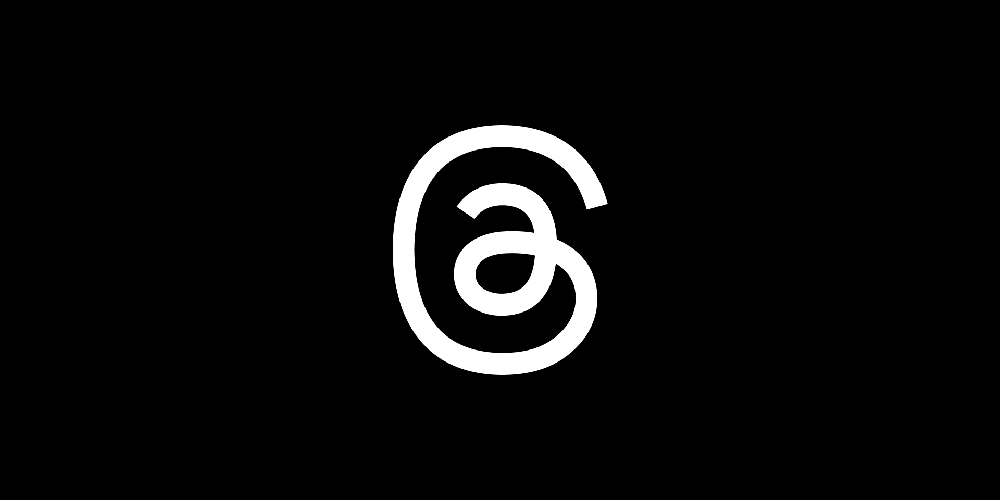

## Sobre

Grupo 7 da disciplina de Requisitos de Software, ministrada pelo professor André Barros.

O objetivo desta documentação é apresentar o trabalho sobre o aplicativo Threads realizado durante o desenvolvimento do projeto da disciplina.

Logo abaixo, está a logo do aplicativo escolhido para ser trabalhado nesse projeto, o Threads (Figura 1).

 Figura 1 - Logo

 Fonte: [Threads](https://threads.net/?hl=pt-br) 

## Equipe do Projeto

    

        <a href="https://github.com/alanagabriele">
                
                <h5 class="text-center">Alana Gabriele</h5>
        </a>
    

    

        <a href="https://github.com/dudupaz">
                
                <h5 class="text-center">Carlos Eduardo</h5>
        </a>
    

     

        <a href="https://github.com/GenilsonJrs">
                
                <h5 class="text-center">Genilson Silva</h5>
        </a>
    

     

        <a href="https://github.com/SamuelRicosta">
                
                <h5 class="text-center">Samuel Ribeiro</h5>
        </a>
    

   

    

## Histórico de Versões

| Versão |    Data    | Descrição                                 | Autor(es)                                          | Revisor(es)                                        |
| ------ | :--------: | ----------------------------------------- | -------------------------------------------------- | -------------------------------------------------- |
| 1.0    | 17/10/2024 | Criação da página e da tabela integrantes | [Alana Gabriele](https://github.com/alanagabriele) | [Carlos Paz](https://github.com/dudupaz)           |
| 2.0    | 21/11/2024 | Mudança da logo do aplicativo escolhido   | [Alana Gabriele](https://github.com/alanagabriele) | [Samuel Ribeiro](https://github.com/SamuelRicosta) |
