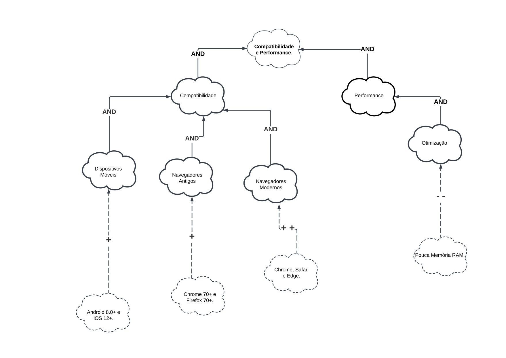
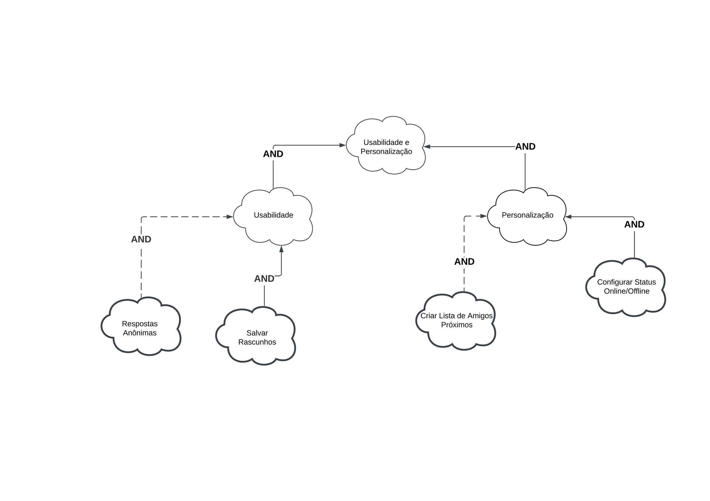

# NFR Framework

## Introdução
O Framework de Requisitos Não Funcionais (NFR) é um método estruturado para lidar com requisitos não funcionais no desenvolvimento de software. Foi criado com o objetivo de auxiliar engenheiros e analistas de sistemas na identificação, representação, análise e monitoramento da satisfação de requisitos não funcionais (como desempenho, segurança, confiabilidade, manutenibilidade, entre outros) ao longo da vida útil do software.

Neste documento, o **Threads**, um aplicativo selecionado para estudo, será utilizado como base para análise e aplicação do framework.

---

## Metodologia

Para que este documento pudesse ser produzido, foram utilizados os requisitos não funcionais presentes no projeto e elicitados no artefato de requisitos, que trata dos requisitos identificados em relação ao aplicativo **Threads**.

O framework leva em consideração o conceito de *softgoal*, que se refere a um objeto desprovido de definição clara e critérios de satisfação sólidos. Esses *softgoals* são utilizados para representar requisitos não funcionais e podem estar conectados entre si, refletindo as influências que exercem no sistema.

---

### Tipos de Softgoals

Os softgoals desempenham um papel essencial na modelagem e no atendimento dos requisitos não funcionais (NFR). Eles são classificados em diferentes tipos conforme apresentado na **Tabela 1**, que detalha suas características e finalidades. A **Figura 1** ilustra visualmente esses tipos, permitindo uma melhor compreensão de suas representações e relações no contexto do desenvolvimento do sistema.

<b>Tabela 1</b> - Tipos de Softgoals

| Tipo de Softgoal               | Descrição                                                                                                                                          |
|--------------------------------|------------------------------------------------------------------------------------------------------------------------------------------------------|
| **Softgoals NFR**              | Representam os requisitos não funcionais e podem ser organizados hierarquicamente no desenvolvimento do projeto.                                   |
| **Softgoals de Operacionalização** | Representam as soluções de implementação para atender aos *softgoals* NFR ou outros *softgoals* de operacionalização. Incluem operações, processos, estruturas de dados e restrições no sistema para cumprir as necessidades indicadas. |
| **Softgoals de Afirmação (CLAIM)** | Consideram as características do domínio, como prioridades e carga de trabalho, no processo de tomada de decisão. Servem como justificativa para apoiar ou negar a priorização e seleção de componentes, facilitando a revisão, justificativa, melhoria do sistema e rastreamento das decisões de desenvolvimento. |

 **Figura 1:** Tipos de Softgoals  

 Autor: Silva, Reinaldo Antônio.

---

### Avaliação de Softgoals  

A avaliação de *softgoals* envolve a análise do nível de satisfação dos requisitos não funcionais, considerando um conjunto de decisões baseadas nas interações entre os requisitos e suas implicações. Esse processo permite identificar como os *softgoals* contribuem para a realização dos objetivos do sistema, bem como compreender possíveis conflitos e incertezas.  

A seguir, são apresentados os tipos de avaliação dos *softgoals* e suas respectivas categorizações:  

- **✓ Satisfeito**: Indica que o requisito não funcional foi plenamente atendido.  
- **𝒲+ Parcialmente satisfeito**: Representa uma satisfação parcial, onde o requisito foi atendido, mas com algumas limitações.  
- **X Não atendido**: Indica que o requisito não funcional não foi realizado.  
- **𝒲- Parcialmente não atendido**: Refere-se a uma realização negativa parcial, onde o requisito apresenta falhas, mas não completamente.  
- **C Conflitante**: Aponta para uma relação de conflito entre os requisitos, onde existem elementos positivos e negativos simultaneamente.  
- **u Indeterminado**: Representa um estado desconhecido ou incerto, onde não há informações suficientes para determinar o nível de atendimento do requisito.  

Para uma visualização prática dos símbolos e suas categorizações, consulte a **Figura 2**. 

 **Figura 2:** Rótulos de propagação de impacto

Autor - <a href="https://github.com/SamuelRicosta" target="_blank">Samuel Ribeiro</a>

---

### Tipos de Contribuições e Decomposições

A análise de contribuições e decomposições desempenha um papel crucial na compreensão do impacto dos elementos sobre os softgoals. A **Tabela 2** apresenta os diferentes tipos de contribuições (positivas e negativas) e suas intensidades, além de destacar os mecanismos de decomposição AND e OR, que indicam as condições necessárias para a satisfação de um softgoal.

<b>Tabela 2</b> - Tipos de Contribuições e Decomposições

| Tipo de Contribuição    | Descrição                                                                                  |
|-------------------------|------------------------------------------------------------------------------------------|
| **Contribuições Positivas (+)** | Indicadores de que uma decisão ou elemento contribui para a satisfação de um *softgoal*.                        |
| **++ (Forte Positiva)** | Uma contribuição muito significativa e positiva.                                        |
| **+ (Fraca Positiva)**  | Uma contribuição positiva moderada.                                                     |
| **Contribuições Negativas (-)** | Indicadores de que uma decisão ou elemento dificulta a satisfação de um *softgoal*.                            |
| **-- (Forte Negativa)** | Um impacto muito significativo e prejudicial.                                           |
| **- (Fraca Negativa)**  | Um impacto negativo moderado.                                                           |
| **Decomposição AND**    | Todos os sub-*softgoals* precisam ser atendidos para que o *softgoal* pai seja satisfeito. |
| **Decomposição OR**     | Apenas um ou mais sub-*softgoals* precisam ser atendidos para que o *softgoal* pai seja satisfeito. |

Autor - <a href="https://github.com/SamuelRicosta" target="_blank">Samuel Ribeiro</a>

---
### Tabela de Requisitos Não Funcionais

A Tabela 3 a seguir lista os Requisitos Não-Funcionais utilizados para a criação do NFR Framework.

<b>Tabela 3</b> - Requisitos Não Funcionais

| **ID**   | **Descrição**                                                                                   | **Rastreabilidade**                |
|----------|-------------------------------------------------------------------------------------------------|-----------------------------------|
| RNF01    | O sistema deve ser compatível com dispositivos móveis de versões Android 8.0 e iOS 12 ou superiores. |                                   |
| RNF02    | O sistema deve garantir que os dados do usuário sejam armazenados de forma segura, com backup regular. |                                 |
| RNF03    | O sistema deve permitir que o usuário altere suas preferências de notificações para personalizar a experiência. |                                  |
| RNF04    | O sistema deve garantir que o feed de publicações seja carregado rapidamente, mesmo com grande volume de conteúdo. |                             |
| RNF05    | O sistema deve ser otimizado para uso em dispositivos com pouca memória RAM.                      |                                   |
| RNF06    | O sistema deve garantir alta disponibilidade, com menos de 1% de tempo de inatividade mensal.       |                                   |
| RNF07    | O sistema deve permitir que o usuário defina um tema escuro ou claro no aplicativo.                |                                   |
| RNF08    | O sistema deve garantir que o conteúdo do usuário seja sempre acessível, com um tempo de recuperação abaixo de 10 segundos. |                                  |
| RNF09    | O sistema deve ser compatível com versões de navegador mais antigas, garantindo funcionalidade em Chrome 70+ e Firefox 70+. |                                   |
| RNF10    | O sistema deve garantir que os dados do usuário sejam armazenados de forma segura, com backup regular. | |
| RNF11    | O sistema deve permitir que o usuário defina preferências de anúncios, como limitar tipos de anúncios exibidos. | |
| RNF12    | O sistema deve permitir que o usuário personalize a exibição de postagens no feed (por exemplo, mostrando mais fotos). | |
| RNF13    | O sistema deve ser compatível com os navegadores mais recentes, como Google Chrome, Safari e Edge. | |

Autor - <a href="https://github.com/SamuelRicosta" target="_blank">Samuel Ribeiro</a>

---
## NFR Framework - NFR01: Compatibilidade e Performance

### Descrição

Este SIG (Sistemas de Informação Gráfica) agrupa requisitos não funcionais relacionados à compatibilidade e performance do sistema Threads. Esses requisitos são cruciais para garantir que o sistema seja acessível e eficiente em diferentes ambientes de uso, desde dispositivos móveis até navegadores web antigos e modernos.

### Requisitos

Os Requisitos utilizados para a confecção da Figura 3 estão presentes na Tabela 3:

- **RQ01**: O sistema deve ser compatível com dispositivos móveis de versões Android 8.0 e iOS 12 ou superiores

- **RQ05**: O sistema deve ser otimizado para uso em dispositivos com pouca memória RAM.

- **RQ09**: O sistema deve ser compatível com versões de navegador mais antigas, garantindo funcionalidade em Chrome 70+ e Firefox 70+.

- **RQ13**: O sistema deve ser compatível com os navegadores mais recentes, como Google Chrome, Safari e Edge.

Com isso, segue a Figura 3 com o NFR relativo a Compatibilidade e Performance:

 **Figura 3:** SIG Compatibilidade e Performance

### Propagacao dos Impactos

A seguir, na Tabela 4, temos a avaliação da propagação dos impactos relativa à Figura 3.

<b>Tabela 4</b> - tabela de Impactos 

| **NFR**                       | **Impacto** | **Avaliador**       |
|-------------------------------|-------------|--------------------|
| Compatibilidade e Performance | **✓**       | [Samuel Ribeiro](https://github.com/SamuelRicosta)           |
| Compatibilidade               | **✓**       | [Samuel Ribeiro](https://github.com/SamuelRicosta)           |
| Dispositivos Moveis           | **✓**       | [Samuel Ribeiro](https://github.com/SamuelRicosta)           |
| Android 8.0+                  | **𝒲+**      | [Samuel Ribeiro](https://github.com/SamuelRicosta)           |
| iOS 12+                       | **𝒲+**      | [Samuel Ribeiro](https://github.com/SamuelRicosta)           |
| Navegadores Antigos           | **✓**       | [Samuel Ribeiro](https://github.com/SamuelRicosta)           |
| Chrome 70+                    | **𝒲+**      | [Samuel Ribeiro](https://github.com/SamuelRicosta)           |
| Firefox 70+                   | **𝒲+**      | [Samuel Ribeiro](https://github.com/SamuelRicosta)           |
| Navegadores Modernos          | **✓**       | [Samuel Ribeiro](https://github.com/SamuelRicosta)           |
| Chrome                        | **✓**       | [Samuel Ribeiro](https://github.com/SamuelRicosta)           |
| Safari                        | **✓**       | [Samuel Ribeiro](https://github.com/SamuelRicosta)           |
| Edge                          | **✓**       | [Samuel Ribeiro](https://github.com/SamuelRicosta)           |
| Performance                   | **✓**       | [Samuel Ribeiro](https://github.com/SamuelRicosta)           |
| Otimizacao                    | **✓**       | [Samuel Ribeiro](https://github.com/SamuelRicosta)           |
| Pouca Memoria RAM             | **X**       | [Samuel Ribeiro](https://github.com/SamuelRicosta)           |

Autor - <a href="https://github.com/SamuelRicosta" target="_blank">Samuel Ribeiro</a>

---
## NFR 02: Desempenho

Este SIG (Sistemas de Informação Gráfica) agrupa requisitos não funcionais relacionados ao desempenho do sistema Threads. Esses requisitos são essenciais para assegurar que o sistema ofereça uma performance consistente, com tempos de resposta rápidos e utilização eficiente dos recursos, independentemente do volume de dados ou da carga de usuários simultâneos. A prioridade é garantir uma experiência fluida e ágil, desde a interação com o feed de postagens até o carregamento de páginas e o processamento de dados em dispositivos diversos.

## Requisitos
Os Requisitos utilizados para a confecção da Figura 3 estão presentes na Tabela 3:

- **RQ46**: O sistema deve garantir tempos de resposta inferiores a 1 segundo para interações usuais.

- **RQ47**: O aplicativo deve minimizar o consumo de bateria em dispositivos móveis, garantindo uma taxa de consumo inferior a 5%.

- **RQ52**: O sistema deve ser otimizado para uso em dispositivos com pouca memória RAM.

- **RQ56**: O sistema deve garantir que o conteúdo do usuário seja sempre acessível, com um tempo de recuperação abaixo de 10 segundos.

Com isso, segue a Figura 3 com o NFR relativo a Compatibilidade e Performance:

<b>Figura 4 </b> - SIG Desempenho

 Autor: [Carlos Eduardo](https://github.com/dudupaz)

#### Propagação dos Impactos - Desempenho

A seguir, na Tabela 5, temos a avaliação da propagação dos impactos relativa à Figura 4.

<b>Tabela 5</b> - Impactos Desempenho

| NFR | Impacto | Avaliador |
|-----|---------|-------|
|Desempenho|  𝒲+| [Carlos Eduardo](https://github.com/dudupaz)|
|Tempo de resposta	 |  𝒲+|  [Carlos Eduardo](https://github.com/dudupaz)|
|Utilização de recursos	| 𝒲-|[Carlos Eduardo](https://github.com/dudupaz)|
|Pouca utilização de recursos	| ✓|[Carlos Eduardo](https://github.com/dudupaz)|
|Feed| 𝒲+|[Carlos Eduardo](https://github.com/dudupaz)|
|Login| 𝒲+|[Carlos Eduardo](https://github.com/dudupaz)|
|Carregamento de postagens inferior a 500ms	| ✓|[Carlos Eduardo](https://github.com/dudupaz)|
|Tempo inferior a 500ms em interações usuais	| 𝒲+|[Carlos Eduardo](https://github.com/dudupaz)|
|Realizar login em menos de 2 segundos	| 𝒲+|[Carlos Eduardo](https://github.com/dudupaz)|
|Usar pouco a CPU	| 𝒲-|[Carlos Eduardo](https://github.com/dudupaz)|
|Minimizar o consumo da bateria		| 𝒲+|[Carlos Eduardo](https://github.com/dudupaz)|

Autor: [Carlos Eduardo](https://github.com/dudupaz) 

## NFR Framework - NFR03: Personalização e Usabilidade

### Descrição

Este SIG (Sistemas de Informação Gráfica) agrupa requisitos não funcionais relacionados à personalização e usabilidade do sistema Threads. Esses requisitos são fundamentais para garantir que o sistema seja flexível, permitindo ao usuário adaptar a plataforma conforme suas preferências, além de melhorar a experiência do usuário, tornando-a mais prática e intuitiva.

### Requisitos
- **RQ01**: O sistema deve permitir que o usuário configure o status online ou offline. (Personalização)
- **RQ02**: O sistema deve permitir a criação de listas de amigos próximos. (Personalização)
- **RQ03**: O sistema deve permitir respostas anônimas em discussões públicas moderadas. (Usabilidade)
- **RQ04**: O sistema deve permitir salvar rascunhos de postagens mesmo sem conexão. (Usabilidade)

Com isso, segue a Figura 5 com o NFR relativo a Personalização e Usabilidade:

 **Figura 5:** Rótulos de propagação de impacto

# Propagacao dos Impactos - Usabilidade

A seguir, na Tabela 4, temos a avaliação da propagação dos impactos relativa à Figura 3.

<b>Tabela 6</b> - Tabela de Impactos 

| **NFR**                     | **Impacto** | **Avaliador**    |
|-----------------------------|-------------|------------------|
| **Usabilidade**              | **✓**       | [Genilson Silva](https://github.com/GenilsonJrs)         |
| **Personalização**           | **✓**       | [Genilson Silva](https://github.com/GenilsonJrs)         |
| **Respostas Anônimas**       | **𝒲+**      | [Genilson Silva](https://github.com/GenilsonJrs)        |
| **Salvar Rascunhos**         | **✓**       | [Genilson Silva](https://github.com/GenilsonJrs)         |
| **Configurar Status Online** | **✓**       | [Genilson Silva](https://github.com/GenilsonJrs)         |
| **Criar Lista de Amigos**    | **𝒲+**      | [Genilson Silva](https://github.com/GenilsonJrs)        |

Autor - <a href="https://github.com/GenilsonJrs" target="_blank">Genilson Silva</a>

## Referências
**CHUNG, L.; NIXON, B. A.; YU, E.; MYLOPOULOS, J.** Non-Functional Requirements in Software Engineering. Springer Science & Business Media, 2000.

**SILVA, Reinaldo Antônio da**. UFPE Repositório. Disponível em: [https://repositorio.ufpe.br/handle/123456789/34150](https://repositorio.ufpe.br/handle/123456789/34150). Acesso em: 22 jun. 2024.

## Histórico de Versões

| Versão | Data       | Descrição           | Autor                                              | Revisor                                      |
| :----: | ---------- | ------------------- | -------------------------------------------------- | -------------------------------------------- |
|  1.0   | 16/12/2024 | Criação do documento | [Samuel Ribeiro](https://github.com/SamuelRicosta) | [Alana Gabriele](https://github.com/alanagabriele) |
|  1.1   | 17/12/2024 | implementação do NFR01   | [Samuel Ribeiro](https://github.com/SamuelRicosta) | [Alana Gabriele](https://github.com/alanagabriele) |
|  1.2   | 17/12/2024 | implementação do NFR02 - Desempenho   | [Carlos Eduardo](https://github.com/dudupaz) | [Alana Gabriele](https://github.com/alanagabriele) |
|  1.3   | 17/12/2024 | implementação do NFR03 - Usabilidade e Personalização   | [Genilson Silva](https://github.com/GenilsonJrs) | [Samuel Ribeiro](https://github.com/SamuelRicosta) |
