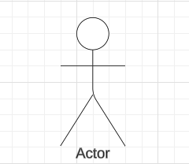
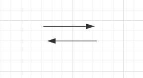

## Introdução
Casos de uso são ferramentas fundamentais para descrever como os usuários interagem com o sistema, destacando as funcionalidades principais de maneira clara e acessível. Eles apresentam cenários que ilustram as ações realizadas pelos usuários e as respostas fornecidas pelo sistema, sem se aprofundar em aspectos técnicos. Esses artefatos ajudam a alinhar as expectativas dos stakeholders e servem como base para o desenvolvimento e validação dos requisitos do sistema.

## Objetivo
O objetivo dos casos de uso é representar de forma estruturada e compreensível as interações entre os usuários e o sistema, garantindo que as necessidades e expectativas dos stakeholders sejam atendidas. Além disso, eles ajudam a identificar e validar os requisitos funcionais, fornecendo um suporte visual e textual que auxilia na comunicação entre a equipe técnica e os envolvidos no projeto.

## Linguagem e Símbolos

Utilizando o software de diagramação LucidChart, foram elaborados diagramas de casos de uso que representam de maneira clara e objetiva as interações entre os atores e o sistema. Esses diagramas visam facilitar o entendimento das funcionalidades principais, destacando os processos e relações envolvidos.

Abaixo, as figuras 1, 2 e 3 apresentam os diagramas criados, acompanhados de suas respectivas simbologias e significados, proporcionando uma visão detalhada e intuitiva do sistema proposto.

### Atores

Os atores representam os diferentes tipos de usuários externos que interagem com o sistema. Eles podem ser identificados como pessoas, outros sistemas ou qualquer componente externo relevante ao contexto da aplicação.

Figura 1 - Atores

 Autor: [Genilson Silva](https://github.com/GenilsonJrs) 

### Sistema

O sistema proposto é definido pelos casos de uso e suas relações internas, além dos atores em seu contexto externo. Ele abrange o conjunto das interações e funcionalidades previstas para atender às necessidades do projeto.

Figura 2 - Sistema

 Autor: [Genilson Silva](https://github.com/GenilsonJrs) 

### Comunicação

A comunicação representa as interações entre atores e casos de uso no sistema. Essas conexões são ilustradas por linhas de associação, geralmente em forma de setas, que conectam os atores aos casos de uso ou estabelecem relações entre diferentes casos de uso.

Figura 3 - Comunicação

 Autor: [Genilson Silva](https://github.com/GenilsonJrs) 

## Histórico de Versões

| **Versão** | **Data**   | **Descrição**          | **Autor(es)**                                      | **Revisor(es)**                                    |
| ---------- | ---------- | ---------------------- | -------------------------------------------------- | -------------------------------------------------- |
| 1.0        | 08/12/2024 | Criação do documento   | [Genilson Silva](https://github.com/GenilsonJrs) | [Alana Gabriele](https://github.com/alanagabriele)   |
| 1.1        | 08/12/2024 | Adição de conteúdo   | [Genilson Silva](https://github.com/GenilsonJrs) | [Alana Gabriele](https://github.com/alanagabriele)   |