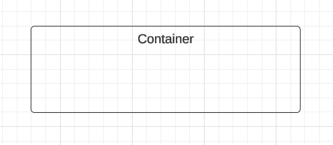

## Introdução

Casos de uso são ferramentas fundamentais para descrever como os usuários interagem com o sistema, destacando as funcionalidades principais de maneira clara e acessível. Eles apresentam cenários que ilustram as ações realizadas pelos usuários e as respostas fornecidas pelo sistema, sem se aprofundar em aspectos técnicos. Esses artefatos ajudam a alinhar as expectativas dos stakeholders e servem como base para o desenvolvimento e validação dos requisitos do sistema.

## Objetivo

O objetivo dos casos de uso é representar de forma estruturada e compreensível as interações entre os usuários e o sistema, garantindo que as necessidades e expectativas dos stakeholders sejam atendidas. Além disso, eles ajudam a identificar e validar os requisitos funcionais, fornecendo um suporte visual e textual que auxilia na comunicação entre a equipe técnica e os envolvidos no projeto.

## Linguagem e Símbolos

Utilizando o software de diagramação LucidChart, foram elaborados diagramas de casos de uso que representam de maneira clara e objetiva as interações entre os atores e o sistema. Esses diagramas visam facilitar o entendimento das funcionalidades principais, destacando os processos e relações envolvidos.

Abaixo, as figuras 1, 2 e 3 apresentam os diagramas criados, acompanhados de suas respectivas simbologias e significados, proporcionando uma visão detalhada e intuitiva do sistema proposto.

### Atores

Os atores representam os diferentes tipos de usuários externos que interagem com o sistema. Eles podem ser identificados como pessoas, outros sistemas ou qualquer componente externo relevante ao contexto da aplicação.

Figura 1 - Atores

 Autor: [Genilson Silva](https://github.com/GenilsonJrs) 

### Sistema

O sistema proposto é definido pelos casos de uso e suas relações internas, além dos atores em seu contexto externo. Ele abrange o conjunto das interações e funcionalidades previstas para atender às necessidades do projeto.

Figura 2 - Sistema

 Autor: [Genilson Silva](https://github.com/GenilsonJrs) 

### Comunicação

A comunicação representa as interações entre atores e casos de uso no sistema. Essas conexões são ilustradas por linhas de associação, geralmente em forma de setas, que conectam os atores aos casos de uso ou estabelecem relações entre diferentes casos de uso.

Figura 3 - Comunicação

 Autor: [Genilson Silva](https://github.com/GenilsonJrs) 

### Diagrama de caso de uso

A figura 4 demonstra o diagrama de casos de uso.

Figura 4 - Diagrama

<iframe allowfullscreen frameborder="0" style="width:640px; height:480px" src="https://lucid.app/documents/embedded/581203f5-2e2e-456d-bec2-ecce4bddfe18" id="_SyyYjD81sqv"></iframe>

Autor: <a href="https://github.com/alanagabriele" target="_blank">Alana Gabriele </a>

### Especialização dos Casos de Uso

#### Caso de Uso 1: Visualizar Tópicos em Alta

| **UC01**              | **Informações**                                                                                                                                                                                      |
| --------------------- | ---------------------------------------------------------------------------------------------------------------------------------------------------------------------------------------------------- |
| **Descrição**         | O usuário é capaz de visualizar tópicos em alta e interagir com as postagens associadas.                                                                                                             |
| **Ator**              | Usuário                                                                                                                                                                                              |
| **Pré-condições**     | Conexão com a internet, acesso ao aplicativo.                                                                                                                                                        |
| **Ação**              | O usuário navega pelos tópicos em alta.                                                                                                                                                              |
| **Fluxo Principal**   | <ul><li>O usuário acessa a tela inicial.</li><li>O sistema exibe tópicos baseados na região ou nas preferências.</li><li>O usuário seleciona um tópico para explorar postagens associadas.</li></ul> |
| **Fluxo Alternativo** | <ul><li>O usuário filtra tópicos por região, idioma ou categoria.</li></ul>                                                                                                                          |
| **Fluxo de Exceção**  | <ul><li>Erro de conexão: O sistema informa que os tópicos em alta não podem ser carregados.</li></ul>                                                                                                |
| **Pós-condições**     | O usuário visualiza e interage com as postagens relacionadas aos tópicos em alta.                                                                                                                    |
| **Rastreabilidade**   | RF01, RF02                                                                                                                                                                                           |

Autor: <a href="https://github.com/alanagabriele" target="_blank">Alana Gabriele </a>

#### Caso de Uso 2: Editar Perfil

| **UC02**              | **Informações**                                                                                                                                                                                                                                     |
| --------------------- | --------------------------------------------------------------------------------------------------------------------------------------------------------------------------------------------------------------------------------------------------- |
| **Descrição**         | O usuário é capaz de editar elementos visuais do perfil e salvar alterações realizadas.                                                                                                                                                             |
| **Ator**              | Usuário                                                                                                                                                                                                                                             |
| **Pré-condições**     | Conexão com a internet, acesso ao aplicativo.                                                                                                                                                                                                       |
| **Ação**              | O usuário personaliza elementos visuais do perfil, como cores, bordas e imagem de fundo.                                                                                                                                                            |
| **Fluxo Principal**   | <ul><li>O usuário acessa a seção de edição de perfil.</li><li>O sistema exibe opções de personalização.</li><li>O usuário escolhe elementos visuais e pré-visualiza ajustes (opcional).</li><li>O usuário salva as alterações realizadas.</li></ul> |
| **Fluxo Alternativo** | <ul><li>O usuário aplica configurações padrão em vez de personalizar manualmente.</li></ul>                                                                                                                                                         |
| **Fluxo de Exceção**  | <ul><li>Erro de conexão: O sistema informa que as alterações não podem ser salvas no momento.</li></ul>                                                                                                                                             |
| **Pós-condições**     | O perfil do usuário é atualizado com as preferências configuradas.                                                                                                                                                                                  |
| **Rastreabilidade**   | RF04                                                                                                                                                                                                                                                |

Autor: <a href="https://github.com/alanagabriele" target="_blank">Alana Gabriele </a>

#### Caso de Uso 3: Enviar Mensagem

| **UC03**              | **Informações**                                                                                                                                              |
| --------------------- | ------------------------------------------------------------------------------------------------------------------------------------------------------------ |
| **Descrição**         | O usuário é capaz de enviar mensagens privadas para outro usuário dentro do aplicativo.                                                                      |
| **Ator**              | Usuário                                                                                                                                                      |
| **Pré-condições**     | Conexão com a internet, acesso ao aplicativo, destinatário ser um usuário no sistema.                                                                        |
| **Ação**              | O usuário seleciona um destinatário, digita a mensagem e envia.                                                                                              |
| **Fluxo Principal**   | <ul><li>O usuário acessa a seção de mensagens.</li><li>Busca um destinatário ou seleciona uma conversa recente.</li><li>Digita e envia a mensagem.</li></ul> |
| **Fluxo Alternativo** | <ul><li>O usuário utiliza mensagens rápidas pré-definidas para responder ao destinatário.</li></ul>                                                          |
| **Fluxo de Exceção**  | <ul><li>Erro de conexão: O sistema informa que a mensagem não pôde ser enviada e a salva como pendente.</li></ul>                                            |
| **Pós-condições**     | O destinatário recebe a mensagem enviada pelo usuário.                                                                                                       |
| **Rastreabilidade**   | RF07, RF08                                                                                                                                                   |

Autor: <a href="https://github.com/alanagabriele" target="_blank">Alana Gabriele </a>

#### Caso de Uso 4: Criar Post

| **UC04**              | **Informações**                                                                                                                                                                                                          |
| --------------------- | ------------------------------------------------------------------------------------------------------------------------------------------------------------------------------------------------------------------------ |
| **Descrição**         | O usuário é capaz de criar posts com sugestões de conteúdo geradas pela IA.                                                                                                                                              |
| **Ator**              | Usuário                                                                                                                                                                                                                  |
| **Pré-condições**     | Conexão com a internet, acesso ao aplicativo.                                                                                                                                                                            |
| **Ação**              | O usuário seleciona sugestões ou edita conteúdo gerado antes de publicar o post.                                                                                                                                         |
| **Fluxo Principal**   | <ul><li>O usuário acessa a tela de criação de post.</li><li>O sistema exibe sugestões baseadas em tendências e preferências.</li><li>O usuário edita as sugestões (opcional) e publica ou salva como rascunho.</li></ul> |
| **Fluxo Alternativo** | <ul><li>O usuário utiliza um modelo genérico de post fornecido pelo sistema.</li></ul>                                                                                                                                   |
| **Fluxo de Exceção**  | <ul><li>Erro de conexão: O sistema informa que o conteúdo não pode ser salvo e oferece um modo offline limitado.</li></ul>                                                                                               |
| **Pós-condições**     | O post é publicado ou salvo no rascunho para futuras edições.                                                                                                                                                            |
| **Rastreabilidade**   | RF09, RF10, RF22                                                                                                                                                                                                         |

Autor: <a href="https://github.com/alanagabriele" target="_blank">Alana Gabriele </a>

## Histórico de Versões

| **Versão** | **Data**   | **Descrição**                            | **Autor(es)**                                      | **Revisor(es)**                                    |
| ---------- | ---------- | ---------------------------------------- | -------------------------------------------------- | -------------------------------------------------- |
| 1.0        | 08/12/2024 | Criação do documento                     | [Genilson Silva](https://github.com/GenilsonJrs)   | [Alana Gabriele](https://github.com/alanagabriele) |
| 1.1        | 08/12/2024 | Adição de conteúdo                       | [Genilson Silva](https://github.com/GenilsonJrs)   | [Alana Gabriele](https://github.com/alanagabriele) |
| 1.2        | 08/12/2024 | Diagrama de caso de uso e especialização | [Alana Gabriele](https://github.com/alanagabriele) | [Carlos Eduardo](https://github.com/dudupaz)       |
