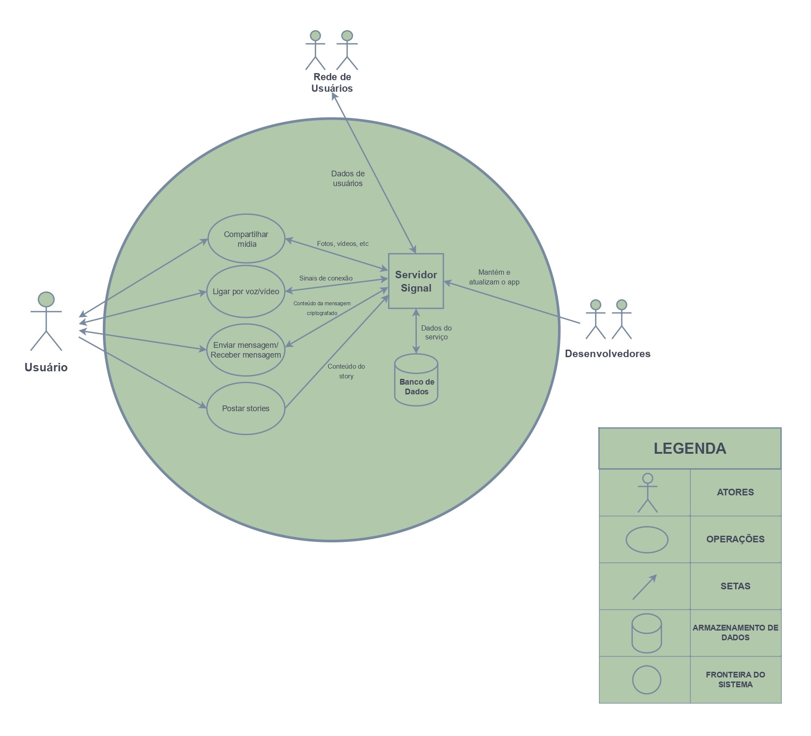
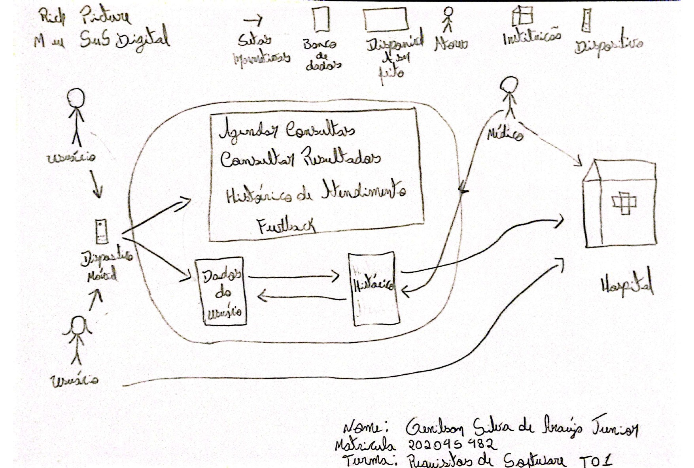

# Aplicativos Avaliados

## Introdução

Este documento tem como propósito apresentar e detalhar uma análise dos aplicativos selecionados pelos integrantes do Grupo 7 da disciplina de Requisitos de Software. Cada membro escolheu e avaliou um aplicativo específico, com o objetivo de identificar o mais adequado para um aprofundamento no levantamento de requisitos. Em um cenário onde os aplicativos desempenham um papel crucial para atender às variadas demandas do público, esta análise comparativa será pautada por critérios como funcionalidade, usabilidade, acessibilidade, impacto e inovação. Vale destacar que, para garantir a originalidade, nenhum dos aplicativos avaliados foi objeto de estudo em semestres anteriores.

## Objetivo

O objetivo deste documento é realizar uma análise detalhada dos aplicativos e de seus rich pictures, selecionados pelos membros do Grupo 7 da disciplina de Requisitos de Software. Buscamos identificar qual deles apresenta maior adequação para um estudo aprofundado, atendendo aos critérios de funcionalidade, usabilidade, acessibilidade e impacto. A partir dessa análise, será escolhido o aplicativo que servirá de base para o desenvolvimento de um projeto de requisitos mais elaborado e detalhado.

## Metodologia

Para conduzir essa análise, cada membro do Grupo 7 selecionou um aplicativo específico e elaborou um rich picture que representa visualmente as principais funcionalidades e a estrutura de cada um. Os aplicativos foram analisados de acordo com critérios previamente estabelecidos, tais como a usabilidade, acessibilidade, potencial de impacto na comunidade e facilidade de aplicação prática.

Após a criação dos rich pictures e das análises individuais, o grupo se reunirá para uma discussão comparativa, considerando a facilidade de identificação de usuários em potencial e a viabilidade de trabalho com o aplicativo escolhido. Esse processo permitirá a seleção do aplicativo que melhor se ajusta às necessidades de um estudo aprofundado e ao desenvolvimento do projeto de requisitos.

  <h2>Aplicativos Avaliados Pelo Grupo 7</h2>

Tabela 1 - Tabela dos aplicativos analisados

<table>
  <tr>
    <th>Nome</th>
    <th>Aplicativo Avaliado</th>
  </tr>
  <tr>
    <td><a href="https://github.com/alanagabriele">Alana Gabriele</a></td>
    <td>Bluesky</td>
  </tr>
  <tr>
    <td><a href="https://github.com/dudupaz">Carlos Eduardo</a></td>
    <td>Signal</td>
  </tr>
  <tr>
    <td><a href="https://github.com/GenilsonJrs">Genilson Silva</a></td>
    <td>Meu SUS Digital</td>
  </tr>
  <tr>
    <td><a href="https://github.com/SamuelRicosta">Samuel Ribeiro</a></td>
    <td>Rocket Chat</td>
  </tr>
</table>

Fonte - <a href="https://github.com/GenilsonJrs">Genilson Silva</a>

  <h2>Bluesky - Alana</h2>

O **BlueSky** é um aplicativo de rede social descentralizada, focado em criar um ambiente digital mais transparente, privado e controlado pelos próprios usuários. Ele foi desenvolvido por ex-funcionários do Twitter com o objetivo de proporcionar uma plataforma onde as interações sejam menos centralizadas, permitindo que os usuários tenham maior controle sobre seu conteúdo e dados.

### **Principais funcionalidades:**

1. **Rede Social Descentralizada**: Ao contrário das redes sociais tradicionais, o BlueSky permite que os usuários criem e gerenciem suas próprias redes (chamadas de "protocolos"), promovendo uma maior liberdade e controle sobre como o conteúdo é compartilhado e visualizado.

2. **Controle de Dados e Privacidade**: O aplicativo prioriza a privacidade dos usuários, permitindo um controle mais detalhado sobre os dados compartilhados e quem pode visualizar suas informações.

3. **Interação e Postagens**: Como outras redes sociais, o BlueSky permite que os usuários publiquem textos, imagens e vídeos, interajam com outros através de curtidas, respostas e repostagens, mas com a vantagem de uma maior personalização nas configurações de privacidade.

4. **Descentralização do Algoritmo**: Em vez de ter um algoritmo centralizado que determina o que aparece no feed, o BlueSky utiliza um sistema descentralizado, permitindo que os usuários escolham e ajustem como as postagens são exibidas.

5. **Liberdade de Personalização**: O aplicativo oferece uma ampla gama de opções para personalizar a experiência de uso, incluindo a criação de diferentes tipos de feeds e a adaptação da interface conforme as preferências do usuário.

6. **Transparência e Código Aberto**: O BlueSky é baseado em um protocolo de código aberto, o que significa que qualquer pessoa pode contribuir para o desenvolvimento e aprimoramento da plataforma, promovendo maior transparência e inovação.

7. **Interação Segura**: A plataforma busca oferecer um ambiente mais seguro, com ferramentas para moderar conteúdo e bloquear interações indesejadas, tudo com o intuito de criar uma comunidade mais saudável.

O **BlueSky** é uma alternativa inovadora às redes sociais tradicionais, proporcionando um espaço onde a privacidade e o controle do usuário estão no centro da experiência. Ele busca transformar a forma como interagimos online, com uma ênfase na descentralização e na transparência.

  <h2>Signal - Carlos</h2>

O **Signal** é um aplicativo de mensagens focado em privacidade e segurança, desenvolvido pela Signal Foundation. Criado com o objetivo de proporcionar uma comunicação segura e protegida contra interceptações, o Signal utiliza criptografia de ponta a ponta para garantir que as mensagens, chamadas e outros dados do usuário sejam completamente privados e inacessíveis a terceiros.

### **Principais funcionalidades:**

1. **Mensagens Criptografadas**: O Signal utiliza criptografia de ponta a ponta em todas as mensagens, garantindo que apenas os remetentes e destinatários possam ler o conteúdo das comunicações. 

2. **Chamadas de Voz e Vídeo Seguras**: Além das mensagens, o Signal oferece chamadas de áudio e vídeo totalmente criptografadas.

3. **Privacidade Avançada:**: O Signal prioriza a privacidade do usuário, oferecendo configurações detalhadas para ocultar dados sensíveis, como remetentes e pré-visualizações de mensagens.

4. **Código Aberto e Transparência**: Todo o código-fonte do Signal é de código aberto, permitindo que qualquer pessoa verifique e contribua para a segurança e aprimoramento da plataforma.

5. **Controle sobre Dados do Usuário**: O Signal permite que os usuários controlem o que é compartilhado, limitando o uso de informações pessoais. 

6. **Segurança em Grupos**: O Signal permite a criação de grupos com mensagens e chamadas criptografadas, mantendo a segurança mesmo em interações com múltiplos participantes.

7. **Recursos de Anonimato**: Para maior proteção, o Signal oferece opções de anonimato, como o recurso de desfocar rostos em imagens e não armazenar metadados associados a mensagens.

8. **Compatibilidade com Multiplataformas**: O aplicativo está disponível em diversas plataformas, incluindo Android, iOS, Windows, macOS e Linux, permitindo que os usuários tenham uma experiência segura e consistente em diferentes dispositivos.

O **Signal** é uma ótima escolha para aqueles que priorizam a privacidade e segurança em suas comunicações. A plataforma fornece uma experiência de uso que valoriza a liberdade do usuário, sem comprometer a proteção de dados pessoais e sem publicidade ou rastreamento, sendo um dos aplicativos de mensagens mais seguros e confiáveis disponíveis atualmente.

Imagem 2 - Rich Picture - Signal

Fonte - <a href="https://github.com/dudupaz">Carlos Paz</a>

  <h2>Meu SUS Digital - Genilson</h2>

O **Meu SUS Digital** é um aplicativo desenvolvido pelo Ministério da Saúde do Brasil, com o objetivo de facilitar o acesso e o gerenciamento de serviços de saúde para a população. Ele oferece uma interface digital para os cidadãos que utilizam o Sistema Único de Saúde (SUS), permitindo consultas e o acesso a informações relacionadas à saúde de maneira prática e eficiente.

### **Principais funcionalidades:**

1. **Carteira de Saúde Digital**: Permite que o usuário tenha acesso à versão digital de sua carteira do SUS, facilitando o acesso aos serviços de saúde.

2. **Agendamento de Consultas e Exames**: O aplicativo possibilita agendar consultas médicas, exames e outros serviços oferecidos pelo SUS, de maneira prática e ágil.

3. **Histórico de Atendimentos**: Os usuários podem consultar o histórico de atendimentos realizados no SUS, incluindo registros de consultas, exames e internações.

4. **Informações sobre Medicamentos**: O aplicativo disponibiliza informações sobre medicamentos de uso contínuo, além de orientações sobre como acessá-los através da rede SUS.

5. **Busca de Serviços de Saúde**: O Meu SUS Digital permite localizar unidades de saúde próximas, como hospitais, clínicas e postos de saúde, além de fornecer detalhes sobre a disponibilidade de serviços.

6. **Alertas e Notificações**: O app envia notificações sobre exames, consultas, vacinas e outros serviços de saúde importantes para o usuário, garantindo que ele se mantenha atualizado.

7. **Acompanhamento de Campanhas de Saúde Pública**: O aplicativo mantém o usuário informado sobre campanhas de vacinação e outras ações importantes promovidas pelo SUS.

O **Meu SUS Digital** busca democratizar o acesso à saúde, tornando os serviços mais acessíveis, transparentes e eficientes, simplificando o processo de utilização do SUS para milhões de brasileiros.

Imagem 3 - Rich Picture - Meu SUS Digital

Fonte - <a href="https://github.com/GenilsonJrs">Genilson Silva</a>

  <h2>Rocket Chat - Samuel Ribeiro</h2>

O **Rocket.Chat** é uma plataforma de comunicação colaborativa de código aberto, projetada para atender às necessidades de equipes e organizações que buscam uma solução completa de mensagens, com total controle sobre a privacidade e segurança dos dados. Ele oferece uma alternativa robusta às ferramentas tradicionais de comunicação empresarial, permitindo um ambiente de comunicação unificado em tempo real.

### **Principais funcionalidades:**

1. **Mensagens em Tempo Real**: O Rocket.Chat permite comunicação em tempo real através de mensagens instantâneas, tanto em chats individuais quanto em grupos, facilitando a troca de informações de forma rápida e eficiente.

2. **Chamadas de Áudio e Vídeo**: O aplicativo inclui suporte para chamadas de áudio e vídeo, permitindo que as equipes se comuniquem de maneira mais pessoal e eficaz sem precisar sair da plataforma.

3. **Personalização e Extensibilidade**: Por ser de código aberto, o Rocket.Chat pode ser personalizado para se adaptar às necessidades específicas de cada organização. Ele permite integração com diversas ferramentas externas e a adição de funcionalidades através de plugins e aplicativos.

4. **Suporte a Multiplataformas**: O Rocket.Chat está disponível em várias plataformas, incluindo web, desktop e dispositivos móveis, garantindo que os usuários possam acessar a comunicação de qualquer lugar, a qualquer momento.

5. **Segurança e Privacidade**: O aplicativo oferece robustas opções de segurança, como criptografia de ponta a ponta, autenticação de dois fatores (2FA) e controle total sobre os dados, permitindo que as empresas mantenham o controle sobre suas informações sensíveis.

6. **Integrações**: O Rocket.Chat oferece integração com diversas plataformas e ferramentas populares, como Slack, Microsoft Teams, Google Drive e GitHub, proporcionando um fluxo de trabalho mais ágil e integrado.

7. **Automatização e Bots**: O Rocket.Chat inclui recursos de automação, como bots que podem ajudar a organizar tarefas, responder perguntas frequentes ou até mesmo realizar ações dentro da plataforma, facilitando a gestão de comunicação.

8. **Controle de Administração**: Os administradores têm acesso a um painel completo de gerenciamento de usuários, permissões e configurações, além de ferramentas de monitoramento e relatórios, garantindo que a plataforma seja gerida de maneira eficiente e segura.

O **Rocket.Chat** é ideal para empresas e equipes que buscam uma solução de comunicação flexível, escalável e segura, oferecendo uma plataforma completa de mensagens, chamadas e colaboração, com o benefício adicional de ser totalmente personalizável e controlada pela própria organização.

Imagem 4 - Rich Picture - Rocket Chat

Fonte - <a href="https://github.com/SamuelRicosta">Samuel Ribeiro</a>

## Bibliografia

## Histórico de Versões

| Versão | Data       | Descrição            | Autor                                            | Revisor                                            |
| :----: | ---------- | -------------------- | ------------------------------------------------ | -------------------------------------------------- |
| `1.0`  | 06/11/2024 | Criação do documento | [Genilson Silva](https://github.com/GenilsonJrs) | [Alana Gabriele](https://github.com/alanagabriele) |
