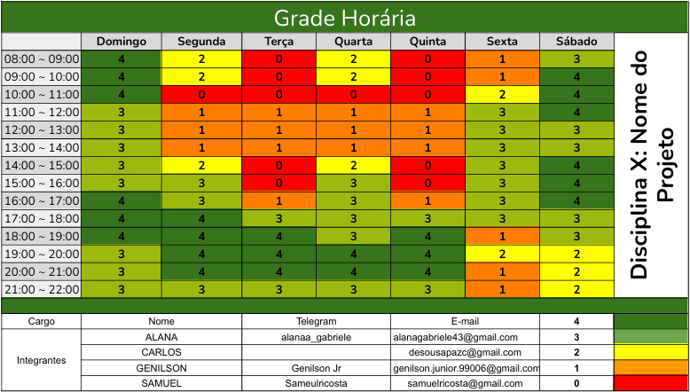

# Introdução

A disciplina de Requisitos de software tem como objetivo a criação de especificações detalhadas para o desenvolvimento de sistemas. Em um grupo de quatro integrantes, estamos desenvolvendo um projeto de requisitos para um aplicativo selecionado pelo grupo. Para garantir um bom andamento e organização do projeto, adotamos uma metodologia que orientará cada etapa do trabalho.

# Heatmaps

Foi criado um **mapa de calor de disponibilidade** (figura 1), onde cada membro da equipe indicou seus horários disponíveis e indisponíveis. Isso proporcionou uma visão clara sobre os melhores momentos para marcar reuniões e realizar atividades.

### Horários para reuniões

<ul> 
<li> Sempre durante a noite, em especial nas terças e quando for possivel nas quintas no mesmos dias das aulas.</li>
</ul>

 Figura 1 - Heatmap de Disponibilidade 

# Metodologia: SCRUM Adaptado

Considerando a familiaridade da equipe com o método SCRUM e a necessidade de um cronograma rígido, escolhemos o SCRUM como metodologia principal para o projeto. Essa abordagem ágil permite flexibilidade nas entregas e foco em interações constantes, o que é essencial para o desenvolvimento de requisitos de um aplicativo.

## Práticas que serão aplicadas:

- **Daily (SCRUM):** Reuniões rápidas pelo WhatsApp para atualizar o status das atividades e manter o alinhamento diário da equipe.
- **Retrospective (SCRUM):** Reuniões realizadas ao final de cada entrega para discutir e identificar pontos de melhoria, promovendo aprendizado contínuo.
- **Review (SCRUM):** Coleta de feedbacks após as apresentações das entregas para ajuste e refinamento do projeto, assegurando que o desenvolvimento atenda às expectativas definidas.

## Bibliografia

> AMAZON WEB SERVICES. _O que é Scrum?_ Disponível em: <https://aws.amazon.com/pt/what-is/scrum/>. Acesso em: 3 de novembro de 2024.  
> SCRUM.ORG. _O Guia do Scrum_ Disponível em: <https://www.scrum.org/resources/scrum-guide>. Acesso em: 3 de novembro de 2024.  
> MOUNTAIN GOAT SOFTWARE. _O que é uma Reunião Diária (Daily Scrum)?_ Disponível em: <https://www.mountaingoatsoftware.com/agile/scrum/daily-scrum>. Acesso em: 3 de novembro de 2024.   
> sAGILE COACHING. _O que é uma Review (Revisão) no Scrum?_ Disponível em: <https://www.scrum.org/resources/what-is-a-sprint-review>. Acesso em: 3 de novembro de 2024. 

# Histórico de Versões

| Versão |    Data    | Descrição         | Autor(es)                                          | Revisor(es)                                        |
| ------ | :--------: | ----------------- | -------------------------------------------------- | -------------------------------------------------- |
| 1.0    | 03/11/2024 | Metodologia scrum | [Samuel Ribeiro](https://github.com/SamuelRicosta) | [Samuel Ribeiro](https://github.com/SamuelRicosta) |
