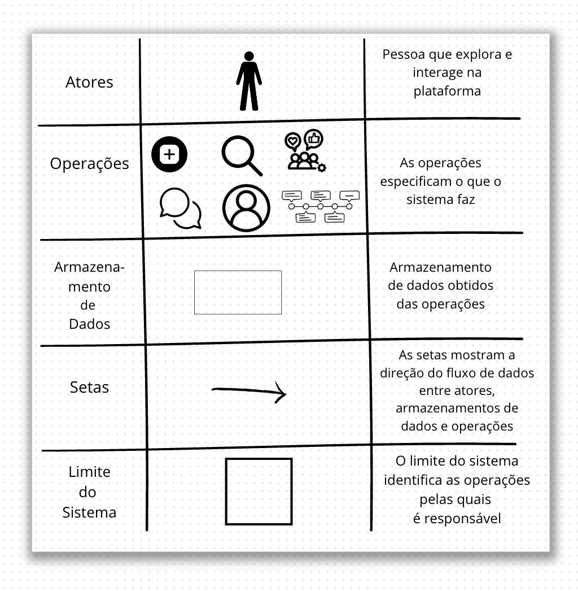

## Introdução

A Rich Picture é descrita como uma ferramenta visual informal que representa as principais características, relacionamentos e complexidades de um sistema ou situação. Desenvolvida dentro da Metodologia de Sistemas Soft (Soft Systems Methodology), criada por Peter Checkland nos anos 1980, ela é projetada para auxiliar no entendimento de problemas complexos, principalmente aqueles que envolvem diversos fatores humanos e interconexões.

### Rich picture do Aplicativo escolhido

Imagem 1 - Rich Picture - BlueSky

 Fonte: [Alana Gabriele](https://github.com/alanagabriele) 

Imagem 2 - Tabela

 Fonte: [Alana Gabriele](https://github.com/alanagabriele) 

## Bibliografia

> CHECKLAND, Peter. Systems Thinking, Systems Practice. Chichester: John Wiley & Sons, 1981. Disponível em: https://www.wiley.com/en-us/Systems+Thinking%2C+Systems+Practice-p-9780471986059. Acesso em: 06 de novembro de 2024.

# Histórico de Versões

| Versão |    Data    | Descrição       | Autor(es)                                          | Revisor(es)                                      |
| ------ | :--------: | --------------- | -------------------------------------------------- | ------------------------------------------------ |
| 1.0    | 06/11/2024 | Criação da tela | [Alana Gabriele](https://github.com/alanagabriele) | [Genilson Silva](https://github.com/GenilsonJrs) |
