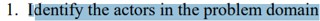
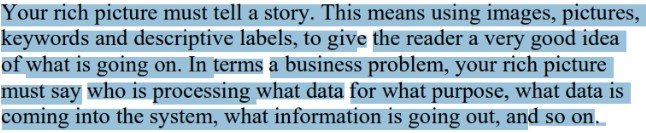
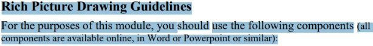

## Introdução

A Rich Picture é descrita como uma ferramenta visual informal que representa as principais características, relacionamentos e complexidades de um sistema ou situação. Desenvolvida dentro da Metodologia de Sistemas Soft (Soft Systems Methodology), criada por Peter Checkland nos anos 1980, ela é projetada para auxiliar no entendimento de problemas complexos, principalmente aqueles que envolvem diversos fatores humanos e interconexões.

### Rich picture do Aplicativo escolhido

Imagem 1 - Rich Picture - BlueSky

 Fonte: [Alana Gabriele](https://github.com/alanagabriele) 

Imagem 2 - Tabela

 Fonte: [Alana Gabriele](https://github.com/alanagabriele) 

## Tabela de Verificação de Rich Pictures

| Pergunta | Descrição | Verificação | Fonte | Imagem de Referência |
|----------|-----------|-------------|-------|-----------------------|
| Identificação dos atores e suas responsabilidades estão conforme? | Verificar se todos os atores do sistema e suas respectivas funções são identificadas. | ☑️ | Software Development Project, Introducing Rich Pictures, p. 4 |  |
| Identificação das operações e quem as executa? | Verificar se todas as operações e os responsáveis por executá-las foram definidos. | ☑️ | Software Development Project, Introducing Rich Pictures, p. 4 | |
| Definição das necessidades de dados para cada operação? | Verificar se as necessidades de dados de cada operação foram claramente definidas. | ☑️ | Software Development Project, Introducing Rich Pictures, p. 4 |  |
| Representação dos fluxos de dados e sua direção? | Confirmar se os fluxos de dados e suas direções estão bem representados. | ☑️ | Software Development Project, Introducing Rich Pictures, p. 3 |  |
| Definição do limite do sistema? | Verificar se o limite do sistema está claramente definido. | ☑️ | Software Development Project, Introducing Rich Pictures, p. 4 |  |
| Uso de imagens, palavras-chave e rótulos descritivos para contar uma história? | Avaliar se há imagens, palavras-chave e rótulos descritivos que ajudam a contar a narrativa do sistema. | ☑️ | Software Development Project, Introducing Rich Pictures, p. 3 |  |
| Comunicação clara de entradas e saídas de dados? | Verificar se as entradas e saídas de dados são comunicadas de maneira clara. | ☑️ | Software Development Project, Introducing Rich Pictures, p. 3 |  |
| Clareza e legibilidade do rich picture? | Confirmar se o rich picture é claro e legível. | ☑️ | Software Development Project, Introducing Rich Pictures, p. 3 |  |
| Identificação de problemas e conflitos potenciais? | Avaliar se possíveis problemas e conflitos foram identificados. | ☑️ | Software Development Project, Introducing Rich Pictures, p. 1 |  |
| Representação de processos de negócios e seus requisitos de dados? | Verificar se os processos de negócios e seus requisitos de dados estão representados. | ☑️ | Software Development Project, Introducing Rich Pictures, p. 1 |  |
| Uso de uma variedade de elementos gráficos para diferenciar componentes? | Verificar se diferentes elementos gráficos foram usados para distinguir os componentes. | ☑️ | Software Development Project, Introducing Rich Pictures, p. 2 |  |
| Identificação e uso de palavras-chave relevantes? | Verificar se palavras-chave relevantes estão identificadas e utilizadas adequadamente. | ☑️ | Software Development Project, Introducing Rich Pictures, p. 2 |  |

#### Legenda de Status

- ✅: Requisito atendido
- ❌: Requisito não atendido
- Pendente: Requisito em andamento ou a ser implementado

## Video de Verificação de Rich Pictures

<iframe width="560" height="315" src="https://www.youtube.com/embed/j7kqMQ2KPno?si=Fq73EOX0I2VZZzHw" title="YouTube video player" frameborder="0" allow="accelerometer; autoplay; clipboard-write; encrypted-media; gyroscope; picture-in-picture; web-share" referrerpolicy="strict-origin-when-cross-origin" allowfullscreen></iframe>

## Bibliografia

> CHECKLAND, Peter. Systems Thinking, Systems Practice. Chichester: John Wiley & Sons, 1981. Disponível em: https://www.wiley.com/en-us/Systems+Thinking%2C+Systems+Practice-p-9780471986059. Acesso em: 06 de novembro de 2024.

# Histórico de Versões

| Versão |    Data    | Descrição       | Autor(es)                                          | Revisor(es)                                      |
| ------ | :--------: | --------------- | -------------------------------------------------- | ------------------------------------------------ |
| 1.0    | 06/11/2024 | Criação da tela | [Alana Gabriele](https://github.com/alanagabriele) | [Genilson Silva](https://github.com/GenilsonJrs) |
| 1.1    | 06/11/2024 | Criação da tabela de verificação | [Samuel Ribeiro](https://github.com/SamuelRicosta) | [Alana Gabriele](https://github.com/alanagabriele) |