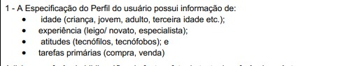

# Verificação dos Artefatos do Projeto Threads

## Introdução

Esta página apresenta os resultados da avaliação dos artefatos desenvolvidos pelo grupo 07, focados no projeto do aplicativo Threads. O documento inclui as Listas de Verificações aplicadas nas inspeções dos artefatos da equipe e, ao final, detalha os resultados obtidos durante essas verificações.

## Objetivo

A verificação tem como propósito assegurar que todos os requisitos de avaliação sejam atendidos de forma completa e consistente. A análise minuciosa dos artefatos visa garantir a qualidade do projeto, identificando eventuais inconsistências e propondo melhorias quando necessário.

## Metodologia

As verificações foram realizadas seguindo uma lista de critérios de avaliação alinhados ao plano de ensino da disciplina. os membros do grupo elaboraram uma Lista de Verificação específica, utilizada para analisar os artefatos com base nos critérios definidos. Durante a verificação, foram registrados comentários e observações relevantes, assegurando a rastreabilidade das análises. Além disso, para garantir a imparcialidade, os artefatos foram avaliados por membros que não participaram diretamente de sua elaboração.

## Responsáveis pelas Verificações

| Artefato                | Verificador                                        |
| ----------------------- | -------------------------------------------------- |
| Técnicas de priorização | [Carlos Paz](https://github.com/dudupaz)           |
| Técnicas de elicitação  | [Alana Gabriele](https://github.com/alanagabriele) |
| Perfil do usuário       | [Samuel Ribeiro](https://github.com/SamuelRicosta) |
| Persona                 | [Genilson Silva](https://github.com/GenilsonJrs)   |

## Verificações

  
Técnicas de priorização

  
Técnicas de elicitação

  <h2>Lista de Verificação</h2>

  

    
<strong>Tabela 2: Lista de Verificação</strong>

  

<table border="1">
     <tr>
        <th>Número</th>
        <th>O GitHub Pages possui:</th>
        <th>Avaliação</th>
        <th>Versão e Data da Última Avaliação</th>
        <th>Imagem de Referência</th>
    </tr>
   <tr>
        <td>1</td>
        <td>Tem participação do cliente e/ou persona no processo de elicitação?</td>
        <td>Sim</td>
        <td>v1.0 - 24/11</td>
        <td>
        <a href="https://aprender3.unb.br/pluginfile.php/2972367/mod_resource/content/52/Plano_de_Ensino%20RE%20022024%20Turma%2002%20v1.pdf">Plano de ensino - RE 022024 - Turma 02, versão 1</a>
         </td>
    </tr>
     <tr>
        <td>2</td>
        <td>Tem a gravação dos processos de elicitação?</td>
        <td>Sim</td>
        <td>v1.0 - 24/11</td>
        <td>
        <a href="https://aprender3.unb.br/pluginfile.php/2972367/mod_resource/content/52/Plano_de_Ensino%20RE%20022024%20Turma%2002%20v1.pdf">Plano de ensino - RE 022024 - Turma 02, versão 1</a>
         </td>
    </tr>
    <tr>
        <td>3</td>
        <td>Tem um moderador na sessão do brainstorming?</td>
        <td>Sim</td>
        <td>v1.0 - 24/11</td>
        <td><a href="https://github.com/Requisitos-de-Software/2024.2-Bluesky/blob/main/docs/verificação/Grupo7/imagens/etapa2/brainstorming.png">IHC - Cap 7 - Técnicas de definição dos requisitos de IHC</a></td>
    </tr>
        <tr>
        <td>4</td>
        <td>Os itens do questionário são claros?</td>
        <td>Sim</td>
        <td>v1.0 - 21/11</td>
         <td><a href="https://github.com/Requisitos-de-Software/2024.2-Bluesky/blob/main/docs/verificação/Grupo7/imagens/etapa2/questionario.png">Milene, Profa.; Maurício, Prof. Elicitação de requisitos: técnicas - priorização</a></td>
    </tr>
     </tr>
        <tr>
        <td>5</td>
        <td>As perguntas da entrevista são curtas e claras?</td>
        <td>Sim</td>
        <td>v1.3 - 24/11</td>
          <td><a href="https://github.com/Requisitos-de-Software/2024.2-Bluesky/blob/main/docs/verificação/Grupo7/imagens/etapa2/entrevista.png">IHC - Cap 7 - Técnicas de definição dos requisitos de IHC</a></td>
    </tr>
    
</table>

    Autora: <a href="https://github.com/alanagabriele" target="_blank">Alana Gabriele</a>
  

<h2>Resultado</h2>

Nenhum problema foi encontrado.

<h2>Gravação</h2>

Vídeo 2 - Verificação do artefato

<iframe width="560" height="315" src="https://www.youtube.com/embed/KEXrb-UMyUQ?si=q4lXH6JL-sYR4Fxz" title="YouTube video player" frameborder="0" allow="accelerometer; autoplay; clipboard-write; encrypted-media; gyroscope; picture-in-picture; web-share" referrerpolicy="strict-origin-when-cross-origin" allowfullscreen></iframe>

    Autora: <a href="https://github.com/alanagabriele" target="_blank">Alana Gabriele</a>
  

  
Perfil do usuário

    

    
<strong>Tabela 3: Lista de Verificação</strong>

  

  <table border="1">
    <tr>
        <th>Id</th>
        <th>Descrição</th>
        <th>Resposta</th>
        <th>Versão, Data e Hora da Avaliação</th>
        <th>Fonte</th>
    </tr>
    <tr>
        <td>01</td>
        <td>O Perfil do Usuário inclui a faixa etária (criança, jovem, adulto, terceira idade, etc.)?</td>
        <td>Sim</td>
        <td>versão 1.0, 24/11</td>
        <td></td>
    </tr>
    <tr>
        <td>02</td>
        <td>O Perfil do Usuário contém informações sobre a experiência (iniciante, leigo, especializado)?</td>
        <td>Sim</td>
        <td>versão 1.0, 24/11</td>
        <td></td>
    </tr>
    <tr>
        <td>03</td>
        <td>O Perfil do Usuário apresenta informações sobre atitudes (tecnófilos, tecnófobos)?</td>
        <td>Sim</td>
        <td>versão 1.0, 24/11</td>
        <td></td>
    </tr>
    <tr>
        <td>04</td>
        <td>O perfil do usuário fornece dados sobre as tarefas principais?</td>
        <td>Sim</td>
        <td>versão 1.0, 24/11</td>
        <td>
  
</td>
    </tr>
  </table>

  

    Autor: <a href="https://github.com/SamuelRicosta" target="_blank">Samuel Ribeiro</a>
  

  <h2>Verificação de Personas</h2>

<h2>Problemas</h2>
Nenhum problema foi encontrado de acordo com a lista de verificação aplicada.

<h2>Sugestões</h2>

Nenhuma sugestão a ser apontada.

<h2>Gravação</h2>

O vídeo pode ser visto direto no <a href="https://www.youtube.com/watch?v=sIH35BJKDB8">YouTube.</a>

Vídeo 3 - Verificação de Personas 

<iframe width="560" height="315" src="https://www.youtube.com/embed/iq64qa6kbRQ?si=IEfyaqcUDpryui0z" title="YouTube video player" frameborder="0" allow="accelerometer; autoplay; clipboard-write; encrypted-media; gyroscope; picture-in-picture; web-share" referrerpolicy="strict-origin-when-cross-origin" allowfullscreen></iframe>

    Autor: <a href="https://github.com/SamuelRicosta" target="_blank">Samuel Ribeiro</a>
  

  
Persona

<!-- Personas  -->
<h2>Lista de Verificação</h2>

  

    
<strong>Tabela 4: Lista de Verificação de Personas</strong>

  

<table border="1">
  <tr>
    <th>Pergunta</th>
    <th>Descrição</th>
    <th>Verificação</th>
    <th>Imagem de Referência</th>
  </tr>
  <tr>
    <td>As personas têm nome e sobrenome?</td>
    <td>Verificar se as personas possuem nome e sobrenome completos, permitindo identificá-las de forma única.</td>
    <td>Sim</td>
    <td><a href="https://github.com/Requisitos-de-Software/2024.2-Threads/blob/main/docs/planejamento/imagens/ref1.png">BARBOSA, Simone D. J. et al. Interação Humano-Computador e Experiência do Usuário. 1. ed. Capítulo 8, item 8.2, p. 167.</a></td>
  </tr>
  <tr>
    <td>As personas têm objetivos relacionados ao produto?</td>
    <td>Verificar se as personas possuem objetivos claros e específicos em relação ao uso do produto, para garantir a adequação do design.</td>
    <td>Sim</td>
    <td><a href="https://github.com/Requisitos-de-Software/2024.2-Threads/blob/main/docs/planejamento/imagens/ref2.png">BARBOSA, Simone D. J. et al. Interação Humano-Computador e Experiência do Usuário. 1. ed. Capítulo 8, item 8.2, p. 168.</a></td>
  </tr>
  <tr>
    <td>As personas possuem especialidade?</td>
    <td>Verificar se as personas possuem uma especialidade ou área de atuação que define seu perfil de uso do produto.</td>
    <td>Sim</td>
    <td><a href="https://github.com/Requisitos-de-Software/2024.2-Threads/blob/main/docs/planejamento/imagens/ref3.png">BARBOSA, Simone D. J. et al. Interação Humano-Computador e Experiência do Usuário. 1. ed. Capítulo 8, item 8.2, p. 168.</a></td>
  </tr>
  <tr>
    <td>Tem descrito o que as personas precisam?</td>
    <td>Verificar se as necessidades das personas estão claramente descritas para orientar o design do produto.</td>
    <td>Sim</td>
    <td><a href="https://github.com/Requisitos-de-Software/2024.2-Threads/blob/main/docs/planejamento/imagens/ref4.png">BARBOSA, Simone D. J. et al. Interação Humano-Computador e Experiência do Usuário. 1. ed. Capítulo 8, item 8.2, p. 168.</a></td>
  </tr>
  <tr>
    <td>O elenco de personas tem entre 3 e 12 personas distintas?</td>
    <td>Verificar se o número de personas está dentro do intervalo adequado (entre 3 e 12), garantindo diversidade de perfis sem sobrecarga de informações.</td>
    <td>Sim</td>
    <td><a href="https://github.com/Requisitos-de-Software/2024.2-Threads/blob/main/docs/planejamento/imagens/ref5.png">BARBOSA, Simone D. J. et al. Interação Humano-Computador e Experiência do Usuário. 1. ed. Capítulo 8, item 8.2, p. 169.</a></td>
  </tr>
</table>

    Autor: <a href="https://github.com/GenilsonJrs" target="_blank">Genilson Silva</a>
  

<h2>Verificação de Personas</h2>

<h2>Problemas</h2>
Nenhum problema foi encontrado de acordo com a lista de verificação aplicada.

<h2>Sugestões</h2>

Nenhuma sugestão a ser apontada.

<h2>Gravação</h2>

O vídeo pode ser visto direto no <a href="https://www.youtube.com/watch?v=sIH35BJKDB8">YouTube.</a>

Vídeo 4 - Verificação de Personas 

<iframe width="560" height="315" src="https://www.youtube.com/embed/sIH35BJKDB8?si=FKNMMKMAQWuakYsG" title="YouTube video player" frameborder="0" allow="accelerometer; autoplay; clipboard-write; encrypted-media; gyroscope; picture-in-picture; web-share" referrerpolicy="strict-origin-when-cross-origin" allowfullscreen></iframe>

    Autor: <a href="https://github.com/GenilsonJrs" target="_blank">Genilson Silva</a>
  

## Análise dos Resultados

As verificações indicam que os artefatos estão alinhados aos critérios estabelecidos, refletindo um trabalho consistente e organizado. Algumas sugestões foram realizadas, como a inclusão de descrições mais detalhadas em determinados documentos, visando maior clareza para os usuários finais. O projeto demonstra evolução e um bom nível de qualidade, com oportunidades pontuais de refinamento.

## Referências

> UNIVERSIDADE DE BRASÍLIA. **Plano de ensino - RE 022024 - Turma 02, versão 1**. Disponível em: [https://aprender3.unb.br/pluginfile.php/2972367/mod_resource/content/52/Plano_de_Ensino%20RE%20022024%20Turma%2002%20v1.pdf](https://aprender3.unb.br/pluginfile.php/2972367/mod_resource/content/52/Plano_de_Ensino%20RE%20022024%20Turma%2002%20v1.pdf). Acesso em: 14 nov. 2024.

## Histórico de Versão

| **Versão** | **Data**   | **Descrição**          | **Autor(es)**                                      | **Revisor(es)**                                    |
| ---------- | ---------- | ---------------------- | -------------------------------------------------- | -------------------------------------------------- |
| 1.0        | 21/11/2024 | Criação do documento   | [Samuel Ribeiro](https://github.com/SamuelRicosta) | [Genilson Silva](https://github.com/GenilsonJrs)   |
| 1.1        | 25/11/2024 | Técnicas de elicitação | [Alana Gabriele](https://github.com/alanagabriele) | [Samuel Ribeiro](https://github.com/SamuelRicosta) |
| 1.0        | 25/11/2024 | Perfil do usuário     | [Samuel Ribeiro](https://github.com/SamuelRicosta) | [Genilson Silva](https://github.com/GenilsonJrs)   |