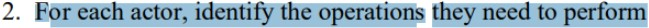
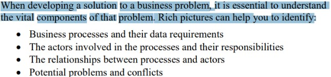

# Verificação do artefato de equipe

## Introdução
Esta página apresenta os resultados da avaliação do artefato de equipe desenvolvido pelo grupo 07, focado no projeto do aplicativo Bluesky. O documento inclui o checklist aplicado na inspeção do artefato de equipe e, ao final, detalha os resultados obtidos durante essa verificação.

## Objetivo
A verificação tem como propósito garantir que todos os requisitos de avaliação sejam atendidos de forma completa. Para isso, é realizada uma análise minuciosa do conteúdo e da estrutura do artefato, com o objetivo de elevar sua qualidade.

## Metodologia
A verificação seguiu uma lista de critérios de avaliação, desenvolvida conforme o plano de ensino da disciplina. Esta lista facilitou a criação de um checklist por cada membro do grupo para confirmar o atendimento de cada critério, permitindo ainda o registro de observações adicionais e comentários relevantes.

## Avaliador (Genilson) - Avaliado (Samuel)

Tabela 1 - Checklist para o Rich Picture

| Pergunta | Descrição | Verificação | Fonte | Imagem de Referência |
|----------|-----------|-------------|-------|-----------------------|
| Identificação dos atores e suas responsabilidades estão conforme? | Verificar se todos os atores do sistema e suas respectivas funções são identificadas. | Sim | Software Development Project, Introducing Rich Pictures, p. 4 |  |
| Identificação das operações e quem as executa? | Verificar se todas as operações e os responsáveis por executá-las foram definidos. | Sim | Software Development Project, Introducing Rich Pictures, p. 4 | |
| Definição das necessidades de dados para cada operação? | Verificar se as necessidades de dados de cada operação foram claramente definidas. | Sim | Software Development Project, Introducing Rich Pictures, p. 4 |  |
| Representação dos fluxos de dados e sua direção? | Confirmar se os fluxos de dados e suas direções estão bem representados. | Sim | Software Development Project, Introducing Rich Pictures, p. 3 |  |
| Definição do limite do sistema? | Verificar se o limite do sistema está claramente definido. | Incompleto | Software Development Project, Introducing Rich Pictures, p. 4 |  |
| Uso de imagens, palavras-chave e rótulos descritivos para contar uma história? | Avaliar se há imagens, palavras-chave e rótulos descritivos que ajudam a contar a narrativa do sistema. | Sim | Software Development Project, Introducing Rich Pictures, p. 3 |  |
| Comunicação clara de entradas e saídas de dados? | Verificar se as entradas e saídas de dados são comunicadas de maneira clara. | Sim | Software Development Project, Introducing Rich Pictures, p. 3 |  |
| Clareza e legibilidade do rich picture? | Confirmar se o rich picture é claro e legível. | Sim | Software Development Project, Introducing Rich Pictures, p. 3 |  |
| Identificação de problemas e conflitos potenciais? | Avaliar se possíveis problemas e conflitos foram identificados. | Sim | Software Development Project, Introducing Rich Pictures, p. 1 |  |
| Representação de processos de negócios e seus requisitos de dados? | Verificar se os processos de negócios e seus requisitos de dados estão representados. | Sim | Software Development Project, Introducing Rich Pictures, p. 1 |  |
| Uso de uma variedade de elementos gráficos para diferenciar componentes? | Verificar se diferentes elementos gráficos foram usados para distinguir os componentes. | Sim | Software Development Project, Introducing Rich Pictures, p. 2 |  |
| Identificação e uso de palavras-chave relevantes? | Verificar se palavras-chave relevantes estão identificadas e utilizadas adequadamente. | Sim | Software Development Project, Introducing Rich Pictures, p. 2 |  |

Autor - <a href="https://github.com/GenilsonJrs">Genilson Junior</a>

## Problemas
O único problema encontrado foi a falta de um limitador do sistema que não se encontra completo ou diretamente visivel.

## Sugestões
Criação de um limitador do sistema desenhado em volta das partes que forem necessárias para estabelecer limites e melhorar o entendimento de quem vizualiza.

## Gravação

O vídeo pode ser visto direto no <a href="https://www.youtube.com/watch?v=auqcIkLm08c">YouTube.</a>

Vídeo 1 - Verificação do Rich Picture do Rocket Chat 

<iframe width="560" height="315" src="https://www.youtube.com/embed/auqcIkLm08c?si=frc7UzhgO9ck88Dj" title="YouTube video player" frameborder="0" allow="accelerometer; autoplay; clipboard-write; encrypted-media; gyroscope; picture-in-picture; web-share" referrerpolicy="strict-origin-when-cross-origin" allowfullscreen></iframe>

Fonte - <a href="https://github.com/GenilsonJrs">Genilson Junior</a>

## Avaliador () - Avaliado ()

## Avaliador () - Avaliado ()

## Avaliador () - Avaliado ()

## Histórico de Versões

| Versão | Data       | Descrição            | Autor                                            | Revisor                                            |
| :----: | ---------- | -------------------- | ------------------------------------------------ | -------------------------------------------------- |
|  1.0   | 08/11/2024 | Criação do documento | [Genilson Silva](https://github.com/GenilsonJrs) | [Alana Gabriele](https://github.com/alanagabriele) |
